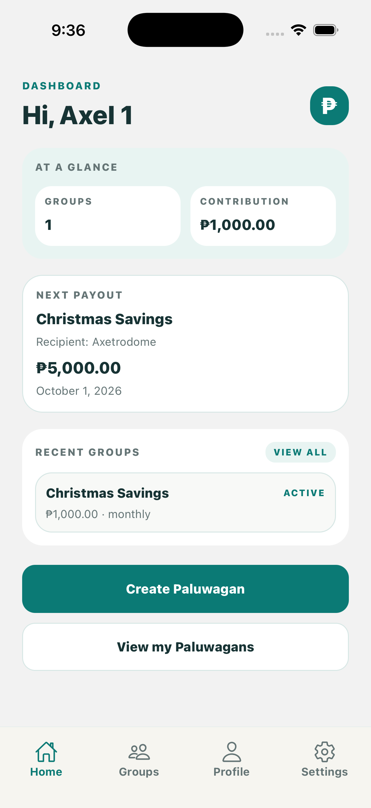
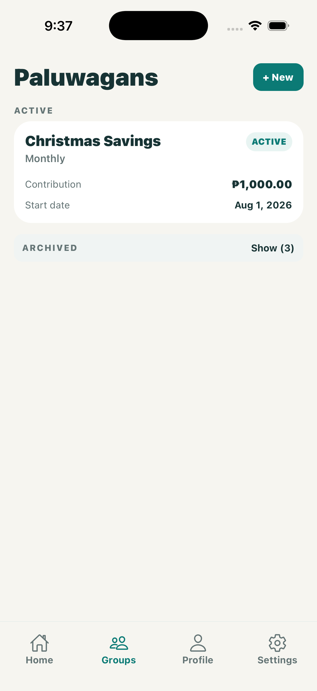
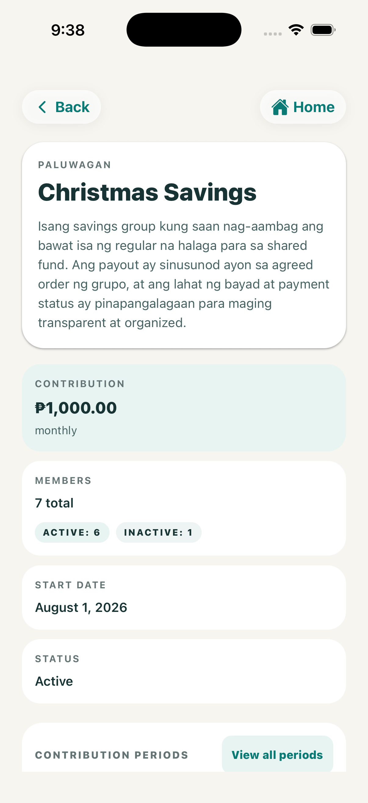
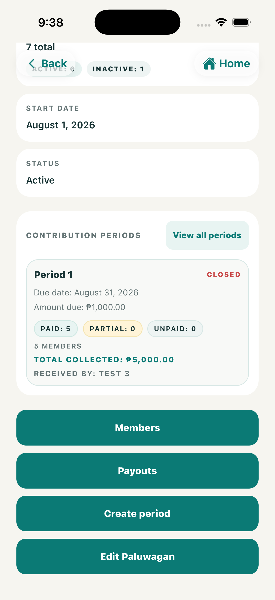
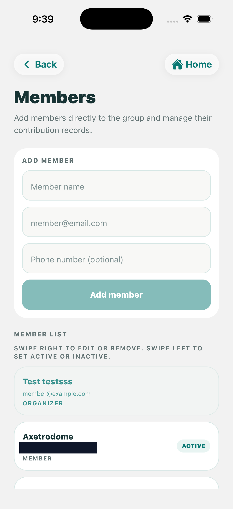
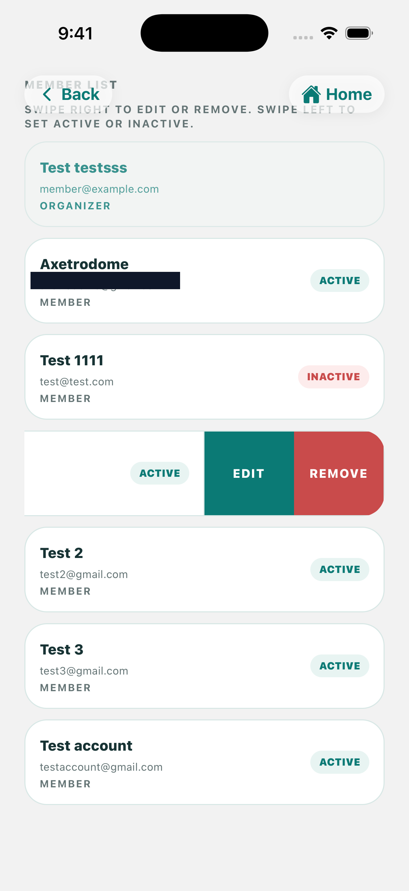
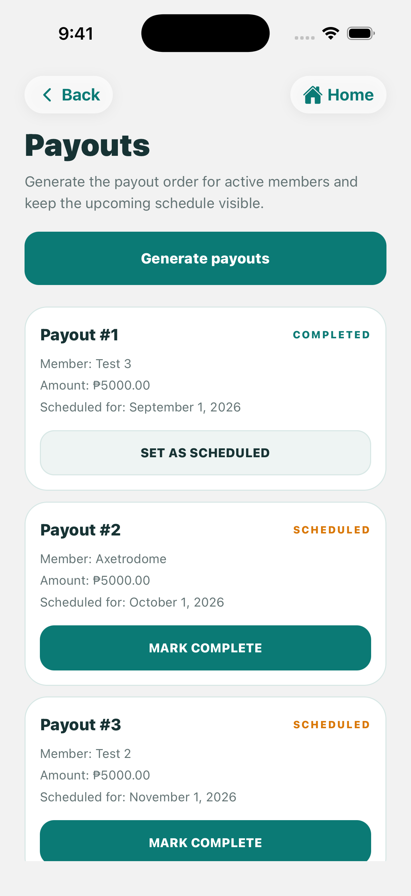

# Paluwagan Manager

A mobile app for organizing and tracking informal Filipino group savings
("Paluwagan") — members, contribution schedules, payment status, payout
order, and proof of payment.

> This app is a record-keeping tool, not a wallet. It never holds,
> transfers, or processes funds. Payments happen outside the app (for
> example: GCash, Maya, cash, bank transfer), and the app only records the
> payment status and proof that the user reports.

See [CLAUDE.md](CLAUDE.md) for the product spec and system rules, and
[AGENTS.md](AGENTS.md) for Expo-specific constraints.

## Screenshots

<table>
  <tr>
    <td align="center"><br/><sub>Dashboard</sub></td>
    <td align="center"><br/><sub>Groups (active/archive)</sub></td>
    <td align="center"><br/><sub>Paluwagan detail</sub></td>
    <td align="center"><br/><sub>Contribution tracking</sub></td>
  </tr>
  <tr>
    <td align="center"><br/><sub>Add member</sub></td>
    <td align="center"><br/><sub>Member management</sub></td>
    <td align="center"><br/><sub>Payout schedule</sub></td>
    <td></td>
  </tr>
</table>

> Screens show test data from a local development build, not a real Paluwagan group.

## Tech stack

- Expo + Expo Router
- React Native + TypeScript
- NativeWind
- Supabase Auth + PostgreSQL + Storage
- Zustand
- React Hook Form + Zod
- Sentry for crash monitoring
- PostHog for product analytics

## Prerequisites

- Node.js 20+
- npm
- A Supabase project
- A Google Cloud project for Google Sign-In
- Xcode + iOS simulator, or Android Studio + emulator
- Optional: Sentry project and PostHog project

## 1. Clone and install

```bash
git clone https://github.com/<your-username>/paluwagan.git
cd paluwagan
npm install
```

## 2. Create a Supabase project

1. Create a project at [supabase.com/dashboard](https://supabase.com/dashboard).
2. Open **Project Settings → API** and copy the **Project URL** and the
   **anon / publishable** key.
3. Keep the **service role** key secret and never expose it to the mobile app.

## 3. Apply the database schema

The SQL migrations live in [supabase/migrations](supabase/migrations/):

- [20260101000000_init_schema.sql](supabase/migrations/20260101000000_init_schema.sql)
- [20260827000000_tighten_contribution_visibility.sql](supabase/migrations/20260827000000_tighten_contribution_visibility.sql)

Apply them with the Supabase CLI:

```bash
npx supabase login
npx supabase link --project-ref <your-project-ref>
npx supabase db push
```

Or run them manually in the Supabase SQL Editor in order.

## 4. Configure the storage bucket

The app stores member payment proof uploads in the `payment-proofs` bucket.

In Supabase:

- create a bucket named `payment-proofs`
- mark it as private
- add storage policies so users can upload their own proof and organizers can view proofs for their own Paluwagan

Do not allow public access to payment proof uploads.

## 5. Deploy the delete-account Edge Function

The account deletion feature uses Supabase Edge Functions. The code is in
[supabase/functions/delete-account](supabase/functions/delete-account).

Deploy it:

```bash
npx supabase functions deploy delete-account
```

This function should be used for self-service account deletion and should not
be bypassed by client-side code.

## 6. Configure authentication

### Email/password auth

This works out of the box with Supabase Auth.

### Google Sign-In

1. In the Google Cloud Console, create an OAuth client ID.
2. In Supabase → **Authentication → Providers → Google**, enable Google.
3. Use this redirect URI for the OAuth callback:

```text
https://<your-project-ref>.supabase.co/auth/v1/callback
```

4. Also allow the app callback scheme in your Supabase URL configuration:

```text
paluwagan://auth/callback
```

## 7. Create your local environment file

Create a `.env.local` file in the project root:

```bash
EXPO_PUBLIC_SUPABASE_URL=https://<your-project-ref>.supabase.co
EXPO_PUBLIC_SUPABASE_PUBLISHABLE_KEY=<your-anon-or-publishable-key>

# Optional: Sentry (runtime crash/error reporting)
EXPO_PUBLIC_SENTRY_DSN=https://<key>@o<org-id>.ingest.sentry.io/<project-id>

# Optional: PostHog analytics
EXPO_PUBLIC_POSTHOG_API_KEY=phc_<your-project-api-key>
EXPO_PUBLIC_POSTHOG_HOST=https://us.i.posthog.com
```

> Do not commit `.env.local`. Never put a Supabase service-role key inside the
> mobile app.

## 8. Sentry setup

This app uses `@sentry/react-native` for runtime error monitoring.

If you want Sentry enabled in local development:

```bash
EXPO_PUBLIC_SENTRY_DSN=https://<key>@o<org-id>.ingest.sentry.io/<project-id>
```

If the native build is failing during symbol upload, disable the auto-upload step
for local testing:

```bash
SENTRY_DISABLE_AUTO_UPLOAD=true npx expo run:ios
```

This does not disable Sentry runtime error capture; it only disables automatic
build-time upload of debug symbols.

## 9. PostHog setup

This app uses `posthog-react-native` for analytics and screen tracking.

Add your PostHog project key to `.env.local`:

```bash
EXPO_PUBLIC_POSTHOG_API_KEY=phc_<your-project-api-key>
EXPO_PUBLIC_POSTHOG_HOST=https://us.i.posthog.com
```

If the API key is not set, analytics are safely disabled.

### PostHog session replay note

If you want to enable session replay, you must run the app as a native build,
not in Expo Go.

That means:

```bash
npx expo prebuild --clean
cd ios && pod install && cd ..
npx expo run:ios
```

For local quick testing without replay, keep replay disabled in
[lib/analytics.ts](lib/analytics.ts).

## 10. Run the app

### Quick start with Expo Go

```bash
npx expo start
```

Then:

- press `i` for iOS simulator
- press `a` for Android emulator
- or scan the QR code in Expo Go

### Native iOS build for PostHog replay / testing more like production

```bash
npx expo prebuild --clean
cd ios && pod install && cd ..
npx expo run:ios
```

Or choose a simulator explicitly:

```bash
npx expo run:ios --simulator="iPhone 16 Pro"
```

## Project structure

```text
app/            Expo Router screens
components/     Reusable UI grouped by feature
lib/            Supabase, auth helpers, validation, Sentry/PostHog wrappers
services/       Business logic and data access
stores/         Zustand store(s)
supabase/       Migrations and Edge Functions
```

## Scripts

```bash
npm start
npm run android
npm run ios
npm run web
npm run lint
```

## Notes for contributors

- Keep business logic out of UI components.
- Prefer Supabase service/query functions over direct query logic inside screens.
- Keep env values in `.env.local` and do not commit them.
- Prefer small, focused changes.
- Do not disable Row Level Security for convenience.

## Why this app exists

Paluwagan Manager is built for Filipino savings circles that still depend on
messaging apps, notebooks, or spreadsheets to track who paid, who is behind,
and who should receive the next payout.

The app is designed to make that process clearer, faster, and easier to audit,
without turning the experience into a financial wallet or money-moving system.

## Core features

- Create and manage a Paluwagan group
- Add and invite members
- Track contribution schedules and payment status
- View next payout and payout history
- Upload payment proof screenshots
- Review proof uploads and approve or reject them
- View dashboard summaries for collected and outstanding amounts
- Manage organizer and member roles

## Who it is for

- Group organizers managing informal savings groups
- Members who want to track payment status and payout position
- People who want a simpler alternative to spreadsheets and chat threads

## App flow overview

A typical user journey looks like this:

1. Sign in with Google or email/password
2. Create or join a Paluwagan group
3. View the contribution schedule and membership list
4. Record or review contribution payments
5. Review payout order and payout schedule
6. Upload payment proof screenshots
7. Track outstanding and completed contributions on the dashboard

This app is designed to replace spreadsheet tracking for informal savings groups,
not to handle money movement itself.

## GitHub-ready open source checklist

Before publishing this repository publicly, make sure the following are ready:

- [ ] Create a new GitHub repository and push the code
- [ ] Confirm all environment values are in `.env.local` and not committed
- [ ] Add Supabase project URL + publishable key to the public setup instructions
- [ ] Add Google OAuth instructions for sign-in and redirect URLs
- [ ] Add migration instructions for the database schema
- [ ] Add storage bucket setup instructions for `payment-proofs`
- [ ] Add PostHog API key instructions for analytics
- [ ] Add Sentry DSN instructions and local note about `SENTRY_DISABLE_AUTO_UPLOAD=true`
- [ ] Add a license file if you plan to open source the app publicly
- [ ] Review any private keys, tokens, or secrets before the first push

## License

No license has been chosen yet for this project.
